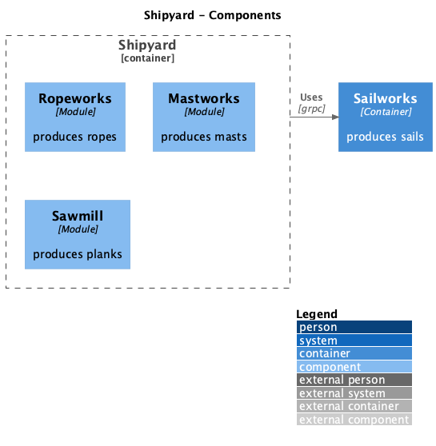

# modular-monolith

This project models a shipyard as a modular monolith:
- the monolith is made of departments (implemented as modules)
- every module is implemented as a private(internal) package, but exposes a public API
  - internal guarantees that other modules don't reference the internals but only use the public API
- this imposes initial effort of having private domain objects being translated to public API objects
  -  how to avoid it?

## Modules

- sawmill (extracted as a separate grpc service)
- ropeworks (local module)
- mastworks (local module)
- sailworks (local module)




## Prerequisites

GRPC is used for communication with sawmill module, thus GRPC tooling for Go must be installed.

### Install protobuf compiler (protoc)

1. download the protoc for x64 archive: https://github.com/protocolbufpfers/protobuf/releases
1. then make it available as terminal command (add it to PATH)
1. test installation:
```bash
    which protoc
    > /home/user/bin/protoc
```

### Install remaining tools

1. make sure `$GOPATH/bin` is on your $PATH
1. run:
```bash
    go get install github.com/bufbuild/buf/cmd/buf
    go install github.com/bufbuild/buf/cmd/buf

    go get google.golang.org/protobuf/cmd/protoc-gen-go
    go install google.golang.org/protobuf/cmd/protoc-gen-go

    go get github.com/bufbuild/connect-go/cmd/protoc-gen-connect-go
    go install github.com/bufbuild/connect-go/cmd/protoc-gen-connect-go

    go get github.com/srikrsna/protoc-gen-gotag
    go install github.com/srikrsna/protoc-gen-gotag
```

## Run

```sh
  make run
```
