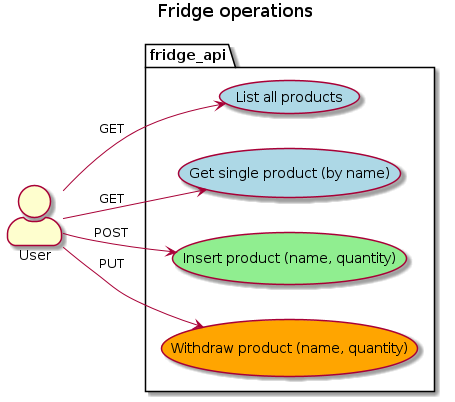

# OpenAPI for Golang

## OpenAPI 3.0.0 spec writing

<https://www.youtube.com/watch?v=6kwmW_p_Tig>


## Swagger 2.0/OpenAPI 3.0 YAML online editors with live preview

- https://editor.swagger.io/ - needs no account
- https://app.swaggerhub.com/ - needs free account

## Example: FridgeAPI



## Generate Golang client from OpenAPI YAML

```bash
output="generated_client/"
docker run --rm  -v `pwd`:/local openapitools/openapi-generator-cli generate  -i /local/fridge_api.yaml -g go -o /local/$output
sudo chown  -R $USER:$USER  $output # by default the generated code is in user:group root:root
```

## Generate Golang server from OpenAPI YAML

```bash
output="generated_server/"
docker run --rm  -v `pwd`:/local openapitools/openapi-generator-cli generate  -i /local/fridge_api.yaml -g go-server -o /local/$output
sudo chown  -R $USER:$USER  $output # by default the generated code is in user:group root:root
```

## Run Golang server

After generating the server, a few little tweaks to the generated code may be needed:
- remove server/go.mod
- update the "openapi" import in server/main.go
- small types fix in generated code

Then:

```bash
go run generated_server/main.go # will serve on port :8080
curl -X GET "http://localhost:8080/products?sort=false" -H  "accept: application/json"
```

## Run swagger-ui

You can connect to the generated server with swagger-ui:

```bash
docker run -p 80:8080 -e SWAGGER_JSON=/local/fridge_api.yaml -v `pwd`:/local swaggerapi/swagger-ui
firefox localhost
```

Note: on sending requests, swagger-ui will return "TypeError: NetworkError when attempting to fetch resource."  
Probably the generated server must be configured with CORS.