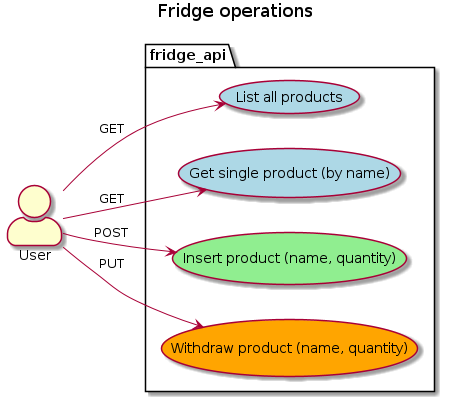

# OpenAPI Demos

This directory contains demos for generating Go code from OpenAPI 3.0.0 specifications using different tools.

## Demos

| Demo | OpenAPI->Go generator | Description |
|------|------|-------------|
| [oapicodegen/](oapicodegen/) | [oapi-codegen](https://github.com/oapi-codegen/oapi-codegen) | Go binary, single file output, net/http |
| [openapigenerator/](openapigenerator/) | [openapi-generator](https://openapi-generator.tech/) | Docker-based, multi-file output, gorilla/mux |

## Common API

Both demos implement the same Fridge API:

- `GET /products` - List all products (optional `?sort=true` for alphabetical)
- `POST /products` - Add a product (`{"name": "Milk", "quantity": 2}`)
- `GET /products/{name}` - Get single product
- `PUT /products/{name}` - Withdraw from product (`{"quantity": 0.5}`)



## Quick Start

### oapi-codegen

```bash
cd oapicodegen
go run ./cmd/server/main.go &
# Test with curl:
curl -X POST http://localhost:8080/products -H "Content-Type: application/json" -d '{"name": "Milk", "quantity": 2}'
curl http://localhost:8080/products
```

### openapi-generator

```bash
cd openapigenerator
go run ./cmd/server/main.go &
# Test with curl:
curl -X POST http://localhost:8080/products -H "Content-Type: application/json" -d '{"name": "Milk", "quantity": 2}'
curl http://localhost:8080/products
```
