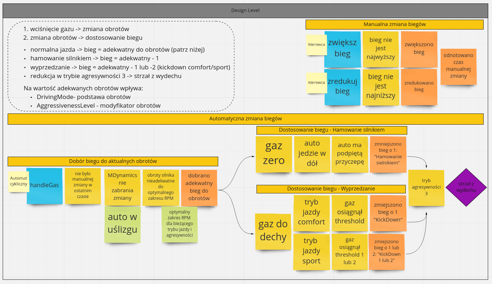
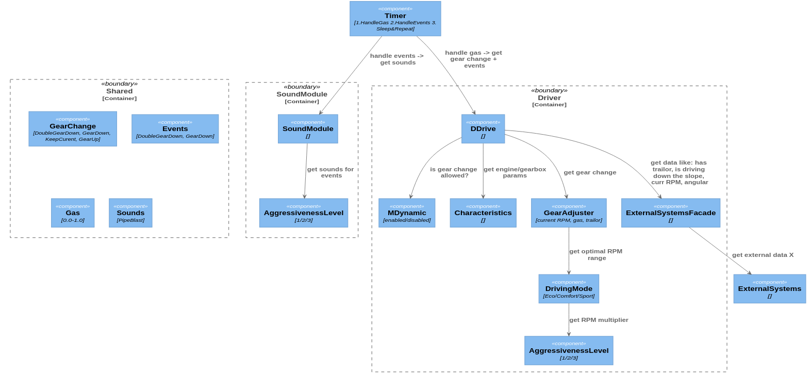

# Automatyczna skrznia biegów - DevUpgrade.online

Propozycja rozwązania dla <http://devupgrade.online/>

## Wymagania

- gdy w trybie M-Dynamic i driftujemy -> nie wolno zmieniać biegu
- gdy zjeżdżamy z górki i ciągniemy przyczepę -> hamowanie silnikiem
- gdy w trybie komfort dociśniemy gaz → kick down
- gdy w trybie sport dociśniemy gaz → kick down 1 lub 2 (zależy ile gazu)
- gdy zmieniono bieg ręcznie → nie wolno zmieniać biegu przez jakiś czas
- gdy poziom drugi agresywności -> docelowe RPM + 30%
- gdy poziom trzeci agresywności -> docelowe RPM + 30% i dodatkowo przy redukcji strzał z wydechu

## Spostrzeżenia

- zasadniczo driver nie potrzebuje obliczać docelowego biegu a tylko wartość o jaką ma się zmienić bieg
- "strzał z wydechu" to chyba nie jest odpowiedzialność drivera
- skrzynia biegów to pewnie embedded. Użyjmy bardziej odpowiedniego niż Java  narzędzia

## Analiza

## Dizajn

## Zależości 

<https://github.com/DevUpgrade-online/gearbox>