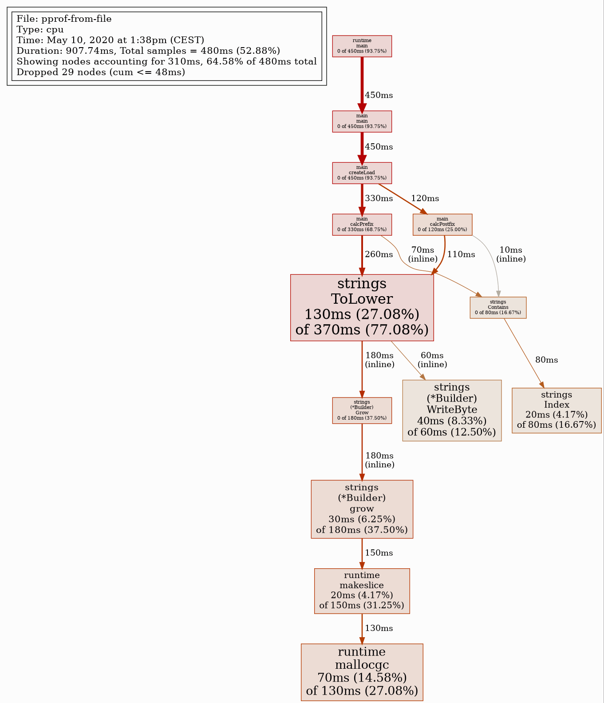
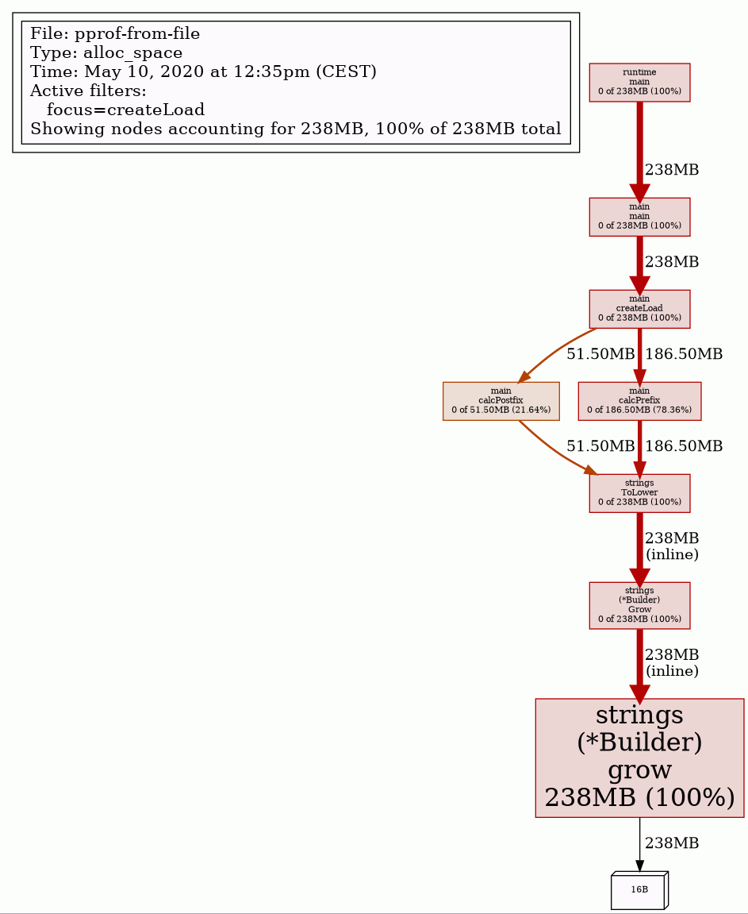

# pprof example: cpu and memory profile from file

(No convenient run_all.sh since this is fully interactive example)

## CPU profile

```bash
go run .
go tool pprof -http=:8080 cpu.out        # beautiful web ui
go tool pprof --nodefraction=0.1 cpu.out # console ui
(pprof) # you are in pprof cli now
```

### (pprof) top 15 -cum

Top cpu offenders sorted by cumulative time  
Cumulative time means time of the function itself + time of the functions called by it

```profile
Showing nodes accounting for 330ms, 68.75% of 480ms total
Showing top 15 nodes out of 54
      flat  flat%   sum%        cum   cum%
         0     0%     0%      420ms 87.50%  main.createLoad
         0     0%     0%      420ms 87.50%  main.main
         0     0%     0%      420ms 87.50%  runtime.main
      60ms 12.50% 12.50%      390ms 81.25%  strings.ToLower
         0     0% 12.50%      300ms 62.50%  main.calcPrefix  <---- this call takes 62.50% cpu time
      10ms  2.08% 14.58%      200ms 41.67%  strings.(*Builder).Grow (inline)
      30ms  6.25% 20.83%      190ms 39.58%  strings.(*Builder).grow (inline)
      10ms  2.08% 22.92%      150ms 31.25%  runtime.makeslice
      90ms 18.75% 41.67%      140ms 29.17%  runtime.mallocgc
      80ms 16.67% 58.33%      130ms 27.08%  strings.(*Builder).WriteByte (inline)
         0     0% 58.33%      120ms 25.00%  main.calcPostfix
      50ms 10.42% 68.75%       50ms 10.42%  strings.(*Builder).copyCheck (inline)
```

### (pprof) list calcPrefix

Source code of function calcPrefix

```go
Total: 480ms
ROUTINE ======================== main.calcPrefix in /home/user/SoftwareDevelopment/GoStudy/src/github.com/mateuszmidor/GoStudy/pprof-from-file/main.go
         0      300ms (flat, cum) 62.50% of Total
         .          .     30:
         .          .     31:func calcPrefix() int {
         .          .     32:   const descr = "descrIption"
         .          .     33:   c := 0
         .          .     34:   for i := 0; i < 12*1000*1000; i++ {
         .      300ms     35:           if strings.Contains(strings.ToLower(descr), "desc") { // most of cpu time is spent here
         .          .     36:                   c++
         .          .     37:           }
         .          .     38:   }
         .          .     39:   return c
         .          .     40:}
```

### (pprof) web createLoad

Render in web browser a call graph of functions that have createLoad on the path



## Memory profile

```bash
go run .
go tool pprof -http=:8080 heap.out   # beautiful web ui
go tool pprof --alloc_space heap.out # console ui
(pprof) # you are in pprof cli now
```

### (pprof) top -cum

Top allocation offenders sorted by cumulative allocations

```profile
Showing nodes accounting for 231.50MB, 99.29% of 233.16MB total
Dropped 3 nodes (cum <= 1.17MB)
      flat  flat%   sum%        cum   cum%
         0     0%     0%   233.16MB   100%  runtime.main
         0     0%     0%   232.66MB 99.79%  main.main
         0     0%     0%   231.50MB 99.29%  main.createLoad
         0     0%     0%   231.50MB 99.29%  strings.(*Builder).Grow (inline)
  231.50MB 99.29% 99.29%   231.50MB 99.29%  strings.(*Builder).grow (inline)
         0     0% 99.29%   231.50MB 99.29%  strings.ToLower
         0     0% 99.29%      180MB 77.20%  main.calcPrefix <----- this call allocates 77.20% of total allocated memory
         0     0% 99.29%    51.50MB 22.09%  main.calcPostfix
```

### (pprof)  list calcPrefix

Source code of function calcPrefix

```go
Total: 233.16MB
ROUTINE ======================== main.calcPrefix in /home/user/SoftwareDevelopment/GoStudy/src/github.com/mateuszmidor/GoStudy/pprof-from-file/main.go
         0      180MB (flat, cum) 77.20% of Total
         .          .     30:
         .          .     31:func calcPrefix() int {
         .          .     32:   const descr = "descrIption"
         .          .     33:   c := 0
         .          .     34:   for i := 0; i < 12*1000*1000; i++ {
         .      180MB     35:           if strings.Contains(strings.ToLower(descr), "desc") { // most of memory is allocated here
         .          .     36:                   c++
         .          .     37:           }
         .          .     38:   }
         .          .     39:   return c
         .          .     40:}
```

### (pprof)  web createLoad

Render in web browser a call graph of functions that have createLoad on the path


