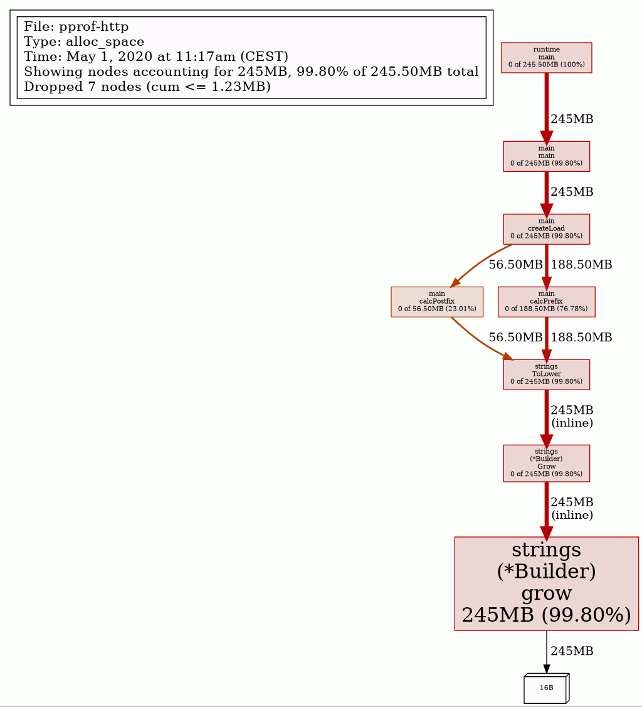

# pprof runtime example

## Run

```bash
go run . &
go tool pprof http://localhost:5000/debug/pprof/allocs
(pprof) top -cum        # show top allocation offenders sorted by cumulative allocations
(pprof) list calcPrefix # show source code of function calcPrefix
(pprof) web             # render call graph in web browser
```

## Result

