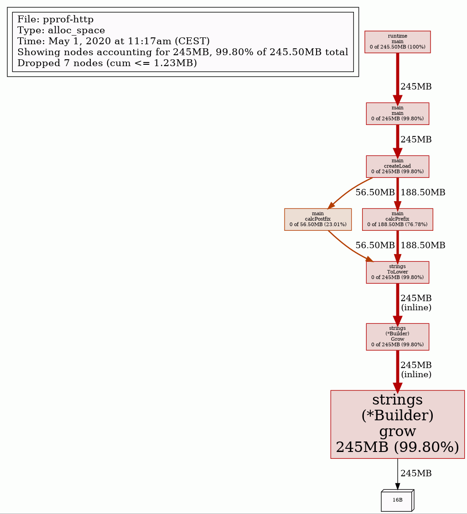

# pprof example: live cpu and memory profile over http

(No convenient run_all.sh since this is fully interactive example)

## Run

```bash
go run . & # this runs http server on port 6060; automatically terminates after 10 min
```

## See all profiles

```bash
firefox http://localhost:6060/debug/pprof/
```

## CPU profile

```bash
go tool pprof http://localhost:6060/debug/pprof/profile?seconds=30
```

## Memory profile

```bash

go tool pprof http://localhost:6060/debug/pprof/heap   # inuse_space
go tool pprof http://localhost:6060/debug/pprof/allocs # alloc_space
```

## Contended mutex holders

```bash
go tool pprof http://localhost:6060/debug/pprof/mutex
```

## Goroutine blocking profile

```bash
go tool pprof http://localhost:6060/debug/pprof/block
```

## Example result of memory profile: alloc_space


