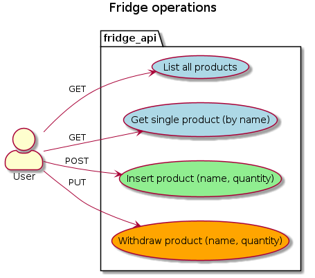

# Swagger for Golang using go-swagger

<https://github.com/go-swagger/go-swagger>

## Swagger 2.0/OpenAPI 3.0 YAML online editors with live preview

- https://editor.swagger.io/ - needs no account
- https://app.swaggerhub.com/ - needs free account

## Example: FridgeAPI



## Install goswagger

```bash
dir=$(mktemp -d) 
git clone https://github.com/go-swagger/go-swagger "$dir" 
cd "$dir"
go install ./cmd/swagger
```

## Validate spec

```bash
swagger validate fridge_api.yaml
> The swagger spec at "fridge_api.yaml" is valid against swagger specification 2.0
```

## Serve API as http

```bash
swagger serve fridge_api.yaml
# web browser opens up
```

## Generate markdown documentation for spec

```bash
swagger generate markdown -f fridge_api.yaml --output fridge_api.md
```

## Generate just the data model

```bash
output="model"
mkdir -p $output
swagger generate model -t $output --spec fridge_api.yaml
```

## Generate client

```bash
output="generated_client"
mkdir -p $output
swagger generate client -t $output -f fridge_api.yaml
 ```

## Generate server

```bash
output="generated_server"
mkdir -p $output
swagger generate server -t $output -f fridge_api.yaml
```

## Run Golang server

```bash
go run generated_server/cmd/fridge-api-server/main.go --port 8080
curl -X GET "http://localhost:8080/products?sort=false" -H  "accept: application/json"
```

## Run swagger-ui

You can connect to the generated server with swagger-ui:

```bash
docker run -p 80:8080 -e SWAGGER_JSON=/local/fridge_api.yaml -v `pwd`:/local swaggerapi/swagger-ui
firefox localhost
```

Note: on sending requests, swagger-ui will return "TypeError: NetworkError when attempting to fetch resource."  
Probably the generated server must be configured with CORS.